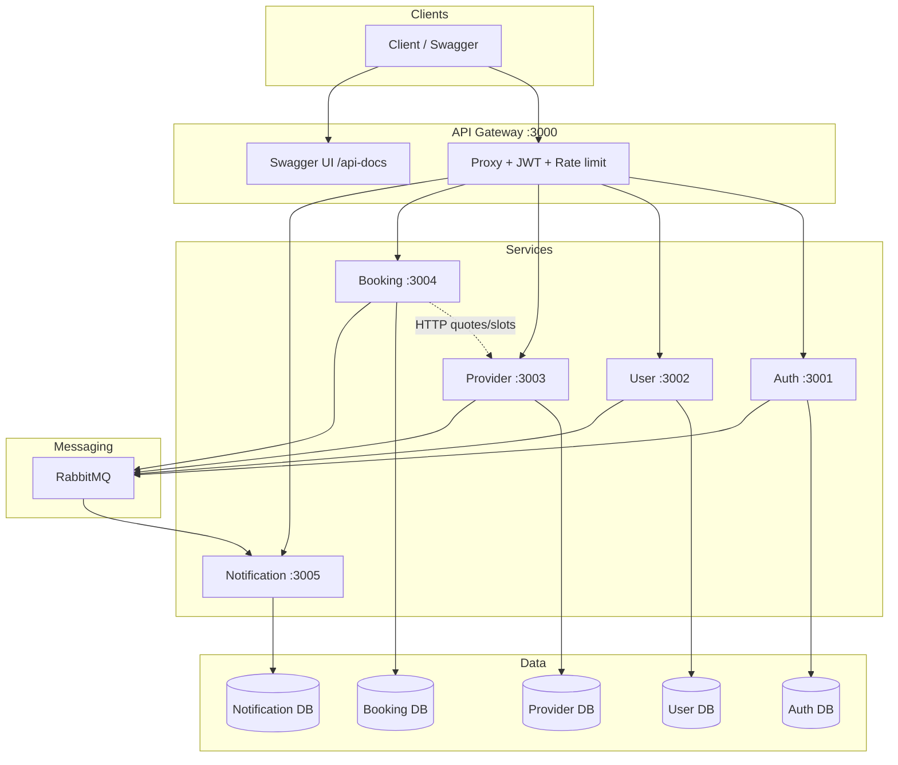
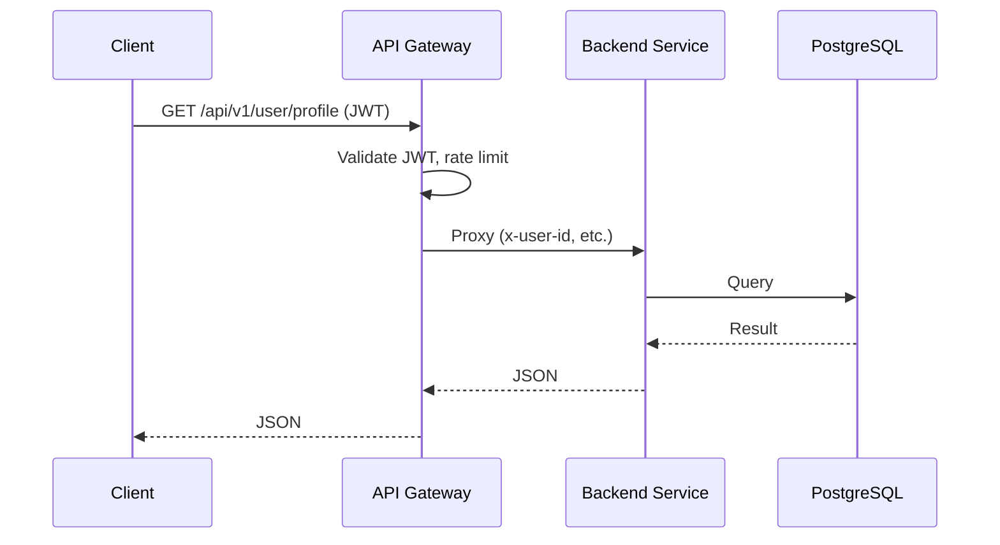
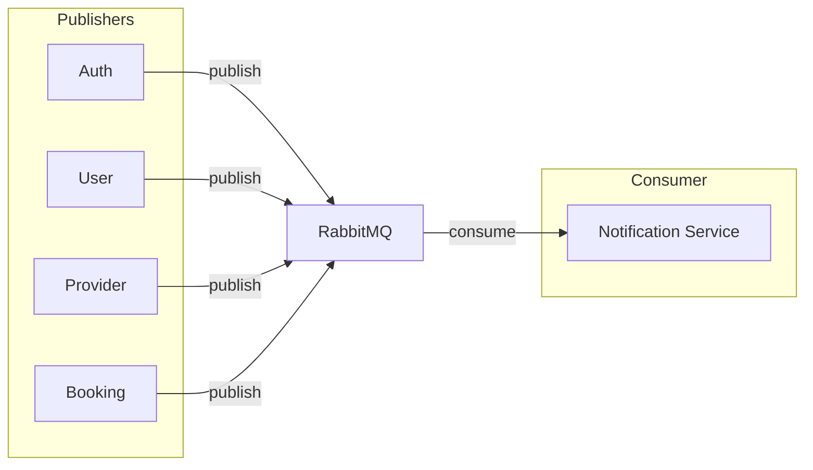

# Hyperlocal Platform

Monorepo for the Hyperlocal platform: API Gateway plus Auth, User, Provider, Booking, and Notification microservices. Full documentation below.

---

## Table of contents

1. [High-level design & diagrams](#high-level-design--diagrams)
2. [Service interaction](#service-interaction)
3. [Repository structure](#repository-structure)
4. [API documentation (Swagger)](#api-documentation-swagger)
5. [Prerequisites](#prerequisites)
6. [Commands](#commands)
7. [Running locally](#running-locally)
8. [Environment](#environment)
9. [CI/CD](#cicd)
10. [Docker](#docker)
11. [Quick reference](#quick-reference)

---

## High-level design & diagrams

### System architecture

All traffic enters via the **API Gateway** (port 3000). The gateway validates JWT (except for auth routes), applies rate limiting, and proxies requests to the appropriate backend service. Each backend service has its own PostgreSQL database and uses **RabbitMQ** for async events (e.g. notifications). **Booking Service** also calls **Provider Service** over HTTP for quotes and available slots. **Notification Service** consumes events from RabbitMQ and creates in-app notifications (and optionally sends email).



### Request flow (synchronous)

Every API call goes: **Client → API Gateway → Backend service → DB (and back)**. Auth routes (signup, login, verify) skip JWT; all other routes require a valid JWT (Bearer or cookie).



### Event flow (asynchronous, notifications)

Auth, User, Provider, and Booking services **publish** notification (or domain) events to **RabbitMQ**. The **Notification Service** **consumes** these events, persists in-app notifications, and optionally sends email.



### Service summary

| Service        | Port | Role                                                                 | DB   | RabbitMQ      | Other              |
|----------------|------|----------------------------------------------------------------------|------|---------------|--------------------|
| API Gateway    | 3000 | Entry point, JWT, rate limit, proxy, Swagger UI                     | —    | —             | —                  |
| Auth           | 3001 | Signup, login (email/phone), OTP, JWT issue/refresh                  | ✅   | Publish       | Cloudinary (opt.)  |
| User           | 3002 | Profile, avatar, addresses                                           | ✅   | Publish       | Cloudinary         |
| Provider       | 3003 | Provider profile, services, service persons, availability, search    | ✅   | Publish       | Cloudinary         |
| Booking        | 3004 | Bookings, Razorpay, OTP (arrival/completion)                         | ✅   | Publish       | HTTP → Provider    |
| Notification   | 3005 | In-app notifications, email                                         | ✅   | Consume       | SMTP (opt.)        |

Shared code: **`packages/shared`** (errors, logger, RabbitMQ client, middlewares, constants).

---

## Service interaction

- **Client ↔ Gateway**: All API calls go to the gateway. Base path `/api/v1`. Swagger at `/api-docs`.
- **Gateway → Auth/User/Provider/Booking/Notification**: HTTP proxy; gateway forwards to `SERVICE_*_URL` and injects headers (e.g. `x-user-id` from JWT).
- **Booking → Provider**: Booking service calls Provider service (e.g. `PROVIDER_SERVICE_URL`) for get-quote and get-available-slots. Synchronous HTTP.
- **Auth/User/Provider/Booking → RabbitMQ**: These services publish events (e.g. notification payloads). No direct service-to-service call for notifications.
- **RabbitMQ → Notification**: Notification service consumes from the notification queue/exchange, creates records in its DB, and optionally sends email.

---

## Repository structure

```
hyperlocal-platform/
├── apps/
│   ├── api-gateway/              # Gateway, Swagger, proxy
│   │   ├── src/
│   │   │   ├── openapi/          # openapi.yaml (single global spec)
│   │   │   ├── routes/            # v1 routes + /api-docs
│   │   │   ├── proxy/
│   │   │   └── ...
│   │   └── Dockerfile
│   ├── authservice/
│   │   ├── src/, tests/, prisma/
│   │   └── Dockerfile
│   ├── userservice/
│   ├── providerservice/
│   ├── bookingservice/
│   └── notificationservice/
├── packages/
│   └── shared/                   # @hyperlocal/shared
│       ├── errors, logger, rabbitmq, middlewares, constants
│       └── package.json (build + exports)
├── package.json                  # Workspace root, Turbo scripts
├── turbo.json
├── docker-compose.yml
└── .github/workflows/ci.yml
```

Each app has: `src/`, `tests/`, `prisma/` (if DB), `package.json`, `Dockerfile`.

---

## API documentation (Swagger)

- **Spec**: Single OpenAPI 3 spec at `apps/api-gateway/src/openapi/openapi.yaml`.
- **Swagger UI**: With the gateway running, open **`http://localhost:3000/api-docs`**.
- **Base path**: `/api/v1` (e.g. `/api/v1/auth/signup`, `/api/v1/bookings`).

---

## Prerequisites

- **Node.js** 20+, **npm** 10+
- **PostgreSQL** (per service that uses a DB)
- **RabbitMQ** (for notifications/events; optional for minimal local dev)
- **Docker & Docker Compose** (optional)

---

## Commands

From the **repository root** (Turbo runs across workspaces).

| Command | Description |
|--------|-------------|
| `npm ci` | Install dependencies (all workspaces) |
| `npm run lint` | Lint all apps and shared |
| `npm run format` | Format with Prettier |
| `npm run build` | Build all (run Prisma generate first if needed) |
| `npm run test` | Run all tests |
| `npm run dev` | Run all services in dev |
| `npm run dev:gateway` | Run only API Gateway in dev |

### Per-service

| Task | From root | From app dir |
|------|-----------|--------------|
| Lint | `npm run lint --workspace=authservice` | `npm run lint` |
| Build | `npm run build --workspace=authservice` | `npm run build` |
| Test | `npm run test --workspace=authservice` | `npm run test` |
| Dev | `npm run dev -- --filter=authservice` | `npm run dev` |
| Prisma generate | `npx prisma generate --schema=apps/authservice/prisma/schema.prisma` | `npx prisma generate` |

### First-time / after Prisma changes

```bash
npx prisma generate --schema=apps/authservice/prisma/schema.prisma
npx prisma generate --schema=apps/bookingservice/prisma/schema.prisma
npx prisma generate --schema=apps/notificationservice/prisma/schema.prisma
npx prisma generate --schema=apps/providerservice/prisma/schema.prisma
npx prisma generate --schema=apps/userservice/prisma/schema.prisma
npm run build
```

---

## Running locally

### Option 1: All services (dev)

1. Set env (e.g. `.env` per app). Gateway needs `SERVICE_AUTH_URL`, `SERVICE_USER_URL`, etc. (e.g. `http://localhost:3001`, `http://localhost:3002`, …).
2. Start PostgreSQL and RabbitMQ.
3. From root: `npm ci`, then Prisma generate (see above), then `npm run dev`.

- Gateway: http://localhost:3000  
- Swagger: http://localhost:3000/api-docs  
- Auth 3001, User 3002, Provider 3003, Booking 3004, Notification 3005  

### Option 2: Docker Compose

```bash
docker compose up --build
```

Ports match the table above. Configure `DATABASE_URL`, `RABBITMQ_URL`, `JWT_SECRET`, etc. via `.env` or `docker-compose.yml` `environment`.

### Option 3: Single service

```bash
npm run dev:gateway
# or: cd apps/authservice && npm run dev
```

---

## Environment

| Area | Variables |
|------|-----------|
| **Gateway** | `PORT`, `JWT_SECRET`, `GATEWAY_API_KEY`, `SERVICE_AUTH_URL`, `SERVICE_USER_URL`, `SERVICE_PROVIDER_URL`, `SERVICE_BOOKING_URL`, `SERVICE_NOTIFICATION_URL` |
| **Auth** | `PORT`, `DATABASE_URL`, `JWT_SECRET`, `JWT_REFRESH_SECRET`, `RABBITMQ_URL`, `GATEWAY_API_KEY`, `OTP_HASH_SECRET` |
| **User / Provider** | `PORT`, `DATABASE_URL`, `GATEWAY_API_KEY`, `RABBITMQ_URL`, Cloudinary vars |
| **Booking** | `PORT`, `DATABASE_URL`, `GATEWAY_API_KEY`, `RABBITMQ_URL`, Razorpay vars, `PROVIDER_SERVICE_URL` |
| **Notification** | `PORT`, `DATABASE_URL`, `GATEWAY_API_KEY`, `RABBITMQ_URL`, SMTP (optional) |

Use `.env` in each app or set in Docker/Compose.

---

## CI/CD

- **Lint**: On every push/PR.
- **Build**: After lint; Prisma generate then build all.
- **Test**: Per-service jobs (auth, booking, notification, provider, user) only when that app or `packages/shared` changes; API Gateway has no unit tests in this pipeline.
- **Docker**: On `main` (and on manual workflow run), build and push images to **GitHub Container Registry** (`ghcr.io/<org>/<repo>/<service>:latest` and `:<sha>`). Uses `GITHUB_TOKEN`; no extra config.
- **Deploy**: Runs only when the workflow is triggered **manually** (Actions → Run workflow). Placeholder; add your deploy steps there.

---

## Docker

- **Per-service image**: Build from repo root:  
  `docker build -f apps/authservice/Dockerfile .`
- **Compose**: `docker-compose.yml` runs all six services; each uses `PORT` and host port as in the service table (e.g. auth 3001:3001).

---

## Quick reference

| What | Where / Command |
|------|------------------|
| Swagger | http://localhost:3000/api-docs |
| Lint | `npm run lint` |
| Format | `npm run format` |
| Build | Prisma generate (see above) then `npm run build` |
| Test | `npm run test` or `npm run test --workspace=<app>` |
| Dev (all) | `npm run dev` |
| Dev (gateway) | `npm run dev:gateway` |
| Docker | `docker compose up --build` |
| Images | Pushed to `ghcr.io/<org>/<repo>/<service>` on `main` |
